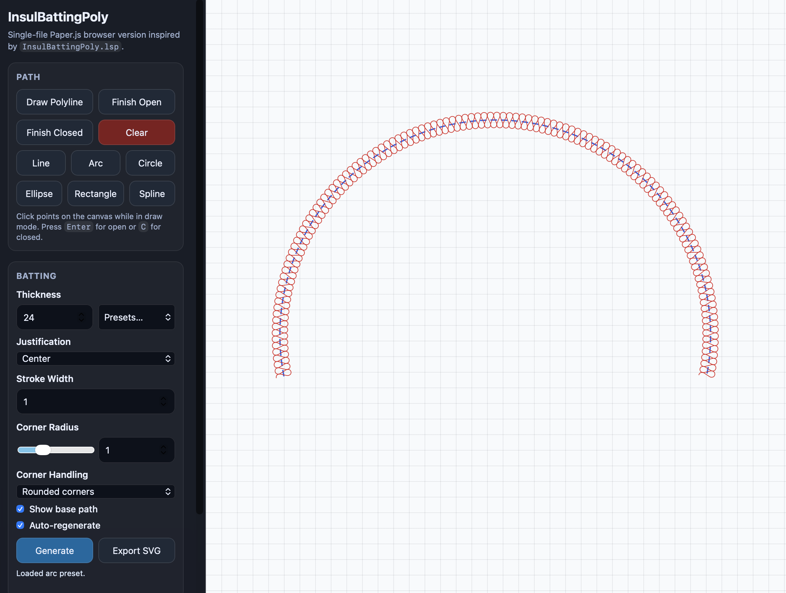
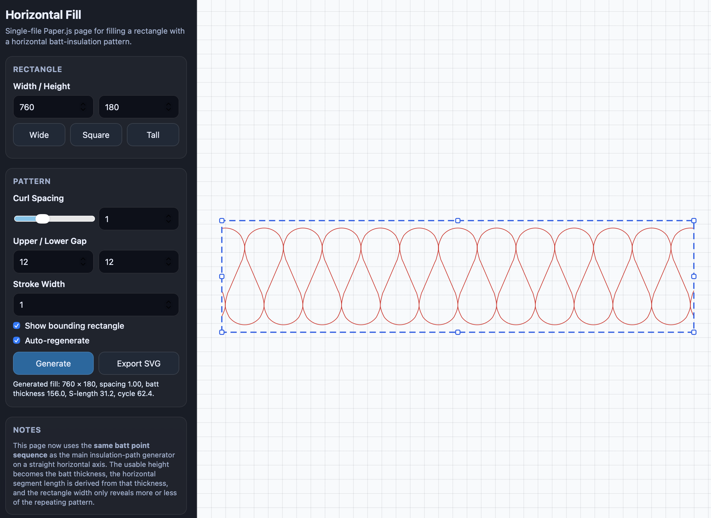

# Insulation Batting Tools

Browser-based experiments and references for the insulation batting pattern from the original AutoCAD LISP routine.

> Disclaimer: these HTML tools are inspired by the original LISP routine, but they are **not** a 1:1 conversion. The algorithms were adapted and tweaked for browser rendering, interaction, clipping, and especially corner handling / corner rounding behavior, as well as horizontal fill behavior.

## Screenshots





## Files

- `index.html`
  - Landing page linking to the tools and source files.

- `insul-batting-paper.html`
  - Interactive Paper.js path-based batting generator.
  - Draw or choose a path, then generate batt curls with thickness, justification, and corner handling.

- `hori-fill.html`
  - Horizontal batt fill tool for a resizable rectangle.
  - Uses the same batt motif on a straight horizontal axis and clips it to the box.

- `paper-full.min.js`
  - Local Paper.js runtime used by the HTML tools.

- `InsulBattingPoly.lsp`
  - Original AutoCAD LISP source by **Kent Cooper**.
  - File note: “Kent Cooper, last edited March 2010”.

## Specs / Notes

These spec/description files are written primarily so coding agents or developers can reimplement the tools in other languages and frameworks.

- `SPEC_PATH_BATTING.md`
  - Detailed description/specification of the path-based batt generation algorithm for agent/developer implementations.

- `SPEC_HORIZONTAL_CLONE.md`
  - Detailed specification of the horizontal fill algorithm for agent/developer implementations.

Note: `INSUL_DESCRIPTION.md` has been superseded by `SPEC_PATH_BATTING.md` as the clearer name for the path-generator spec.

## Usage

Open `index.html` in a browser and choose a tool.

If your browser blocks local file access for some features, run a small local web server, for example:

```bash
python3 -m http.server
```

Then open:

```text
http://localhost:8000/
```

## Credits

Original LISP routine:

- **Kent Cooper**

This repository contains browser-based reinterpretations and documentation inspired by that original routine. They intentionally diverge in places and should be understood as faithful-looking adaptations rather than exact ports.
